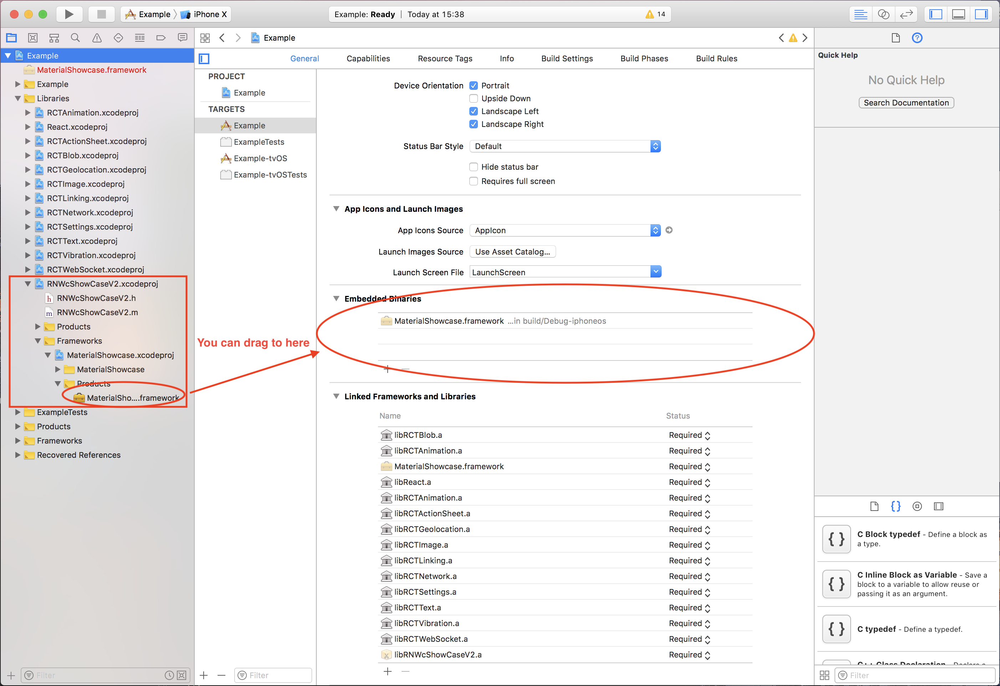
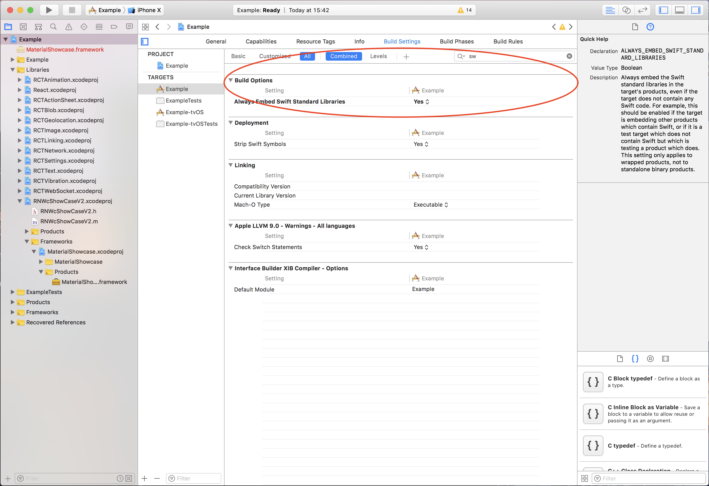

<p align="center">
  <a href="https://www.npmjs.com/package/wcchimiiz-show-case-v2"></a>
  <a href="https://github.com/WCChimiiz/react-native-WcShowCaseV2/pulls"></a>
  <a href="https://github.com/WCChimiiz/react-native-WcShowCaseV2#License"></a>
</p>

# wcchimiiz-show-case-v2

This library is a React Native bridge around native libraries. It allows show/guide beautiful tours:

| **Android: [KeepSafe/TapTargetView](https://github.com/KeepSafe/TapTargetView)**             |
| ----------------- |
|                   |


| **iOS: [aromajoin/material-showcase-ios](https://github.com/aromajoin/material-showcase-ios)**             |
| ----------------- |
| 

## Getting started

`$ npm install wcchimiiz-show-case-v2 --save`

`$ react-native link wcchimiiz-show-case-v2`

- **Android**
  - in ./android/app/src/build.gradle
    ```
    android {
      compileSdkVersion 25
      buildToolsVersion "25.0.2"
      .
      .
      .
    }
    ```
- **iOS**
    - Add [aromajoin/material-showcase-ios](https://github.com/aromajoin/material-showcase-ios) in Embedded Binaries & Linked Frameworks and Libraries. You can find this library from below path:
    - Please find below screenshot reference for the same 
    - 
    - 


## Usage
```javascript
import {AppTour, AppTourSequence, AppTourView} from 'wcchimiiz-show-case-v2';
```

**Props**
  - title #String
  - description #String
  - outerCircleColor #hexCodeRGB
  - targetHolderColor #hexCodeRGB
  - outerCircleAlpha #String(0.00 - 1.00)
  - targetRadius #String(0 - 100)
  - titleTextSize #String(0 - 100)
  - descriptionTextSize #String(0 - 100)
- Only iOS
  - backgroundColor #hexCodeRGB
- Only Android
  - dimColor #hexCode
  - drawShadow #Boolean
  - cancelable #Boolean
  - tintTarget #Boolean


## Credits
- Android: [KeepSafe/TapTargetView](https://github.com/KeepSafe/TapTargetView)
- iOS: [aromajoin/material-showcase-ios](https://github.com/aromajoin/material-showcase-ios)
- RN: [prscX/react-native-app-tour](https://github.com/prscX/react-native-app-tour)
